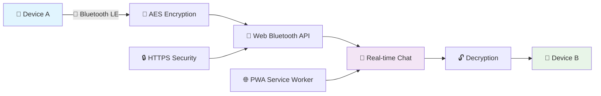

# 📡 Bluetooth Chat Web — Secure Wireless Messaging Platform

<div align="center">


**Revolutionary Peer-to-Peer Messaging via Web Bluetooth API**

*Secure, private, and lightning-fast communication without internet connectivity*

---

[](https://your-demo-url.vercel.app)
[](#-comprehensive-features)
[](#-mobile-installation)

</div>

## 🌟 Revolutionary Communication Platform

### 🎯 **What Makes It Extraordinary**

Bluetooth Chat Web revolutionizes wireless communication by enabling secure, peer-to-peer messaging directly through your browser. No servers, no internet required—just pure device-to-device connectivity powered by cutting-edge Web Bluetooth technology.

<div align="center">



</div>

### ✨ **Core Capabilities Matrix**

| Feature | Technology | Benefit |
|---------|------------|---------|
| 📡 **Bluetooth Messaging** | Web Bluetooth API | Direct device communication without internet |
| 🔐 **Military-Grade Encryption** | AES-256 Encryption | End-to-end message security |
| 📱 **Progressive Web App** | Service Workers + Manifest | Install as native mobile app |
| ⚡ **Lightning Performance** | Vite Build System | Sub-second load times |
| 🌐 **Secure Communication** | HTTPS/TLS Protocol | Protected data transmission |
| 💬 **Real-time Interface** | React 18 Features | Smooth, responsive chat experience |

---

## 🚀 Comprehensive Features

### 📡 **Advanced Bluetooth Communication**

#### **Web Bluetooth API Integration**
- **Device Discovery**: Automatic scanning for nearby Bluetooth devices
- **GATT Protocol**: Generic Attribute Profile for device communication
- **Service UUID Management**: Custom Bluetooth service identifiers
- **Characteristic Handling**: Read/write operations for data transfer
- **Connection Monitoring**: Real-time connection status tracking

#### **Smart Connection Management**
```javascript
// Advanced Bluetooth connection with error handling
async function connectToDevice() {
  try {
    const device = await navigator.bluetooth.requestDevice({
      acceptAllDevices: true,
      optionalServices: ['battery_service', 'custom_chat_service']
    });
    
    const server = await device.gatt.connect();
    return server;
  } catch (error) {
    console.error('Bluetooth connection failed:', error);
  }
}
```

### 🔐 **Enterprise-Grade Security**

#### **AES-256 Encryption System**
- **Optional Encryption**: Toggle encryption on/off based on privacy needs
- **Key Exchange**: Secure key sharing between devices
- **Message Integrity**: Cryptographic hash verification
- **Forward Secrecy**: New keys for each session

#### **Security Architecture**
```javascript
// AES encryption implementation
import CryptoJS from 'crypto-js';

function encryptMessage(message, secretKey) {
  return CryptoJS.AES.encrypt(message, secretKey).toString();
}

function decryptMessage(ciphertext, secretKey) {
  const bytes = CryptoJS.AES.decrypt(ciphertext, secretKey);
  return bytes.toString(CryptoJS.enc.Utf8);
}
```

### 📱 **Progressive Web App Excellence**

#### **PWA Features**
- **Offline Functionality**: Works without internet connection
- **Install Prompt**: Add to home screen capability
- **Background Sync**: Message queue for offline messages
- **Push Notifications**: Alert users of new messages
- **App Icons**: Custom icons for all device types

#### **Service Worker Configuration**
```javascript
// Advanced service worker for offline support
self.addEventListener('install', (event) => {
  event.waitUntil(
    caches.open('bluetooth-chat-v1').then((cache) => {
      return cache.addAll([
        '/',
        '/index.html',
        '/assets/main.js',
        '/assets/styles.css'
      ]);
    })
  );
});
```

### 💬 **Real-Time Chat Interface**

#### **Modern UI Components**
- **Message Bubbles**: Styled sender/receiver differentiation
- **Typing Indicators**: Real-time typing status
- **Read Receipts**: Message delivery confirmation
- **Emoji Support**: Rich text formatting
- **File Sharing**: Bluetooth file transfer capability

---

## ⚙️ Advanced Technology Stack

<div align="center">

### **Frontend Architecture**
| Component | Technology | Purpose |
|-----------|------------|---------|
| **Framework** | React 18+ | Modern UI with concurrent features |
| **Build Tool** | Vite 5.0+ | Lightning-fast HMR and builds |
| **Language** | TypeScript | Type-safe development |
| **Styling** | Tailwind CSS | Utility-first responsive design |
| **State Management** | Zustand/Redux | Predictable state updates |

### **Core Technologies**
| Component | Technology | Purpose |
|-----------|------------|---------|
| **Communication** | Web Bluetooth API | Device-to-device connectivity |
| **Encryption** | CryptoJS (AES-256) | Secure message encryption |
| **PWA** | Workbox + Vite PWA Plugin | Progressive web app features |
| **Security** | HTTPS/TLS | Secure communication protocol |

</div>

---

## 🏗️ Project Architecture

### **📂 Clean Code Structure**

```
bluetooth-chat-web/
├── 📁 public/                          # Static assets
│   ├── manifest.json                   # PWA manifest
│   ├── icons/                          # App icons (multiple sizes)
│   └── service-worker.js               # Custom service worker
├── 📁 src/                             # Source code
│   ├── 📁 components/                  # React components
│   │   ├── BluetoothScanner.tsx        # Device discovery
│   │   ├── ChatInterface.tsx           # Main chat UI
│   │   ├── MessageBubble.tsx           # Message display
│   │   ├── ConnectionStatus.tsx        # Connection indicator
│   │   └── EncryptionToggle.tsx        # Security controls
│   ├── 📁 hooks/                       # Custom React hooks
│   │   ├── useBluetoothConnection.ts   # Bluetooth management
│   │   ├── useEncryption.ts            # Encryption utilities
│   │   └── usePWA.ts                   # PWA features
│   ├── 📁 utils/                       # Utility functions
│   │   ├── bluetooth.ts                # Bluetooth helpers
│   │   ├── encryption.ts               # Crypto functions
│   │   └── storage.ts                  # Local storage helpers
│   ├── 📁 types/                       # TypeScript definitions
│   │   ├── bluetooth.d.ts              # Bluetooth types
│   │   └── message.d.ts                # Message types
│   ├── 📁 styles/                      # Stylesheets
│   │   └── global.css                  # Global styles
│   ├── App.tsx                         # Main application
│   └── main.tsx                        # Entry point
├── 📁 cert/                            # SSL certificates (development)
│   ├── key.pem                         # Private key
│   └── cert.pem                        # Certificate
├── vite.config.ts                      # Vite configuration
├── tsconfig.json                       # TypeScript config
├── tailwind.config.js                  # Tailwind config
├── package.json                        # Dependencies
└── README.md                           # Documentation
```

---

## ⚡ Lightning-Fast Setup

### **🔧 Prerequisites**

| Requirement | Version | Purpose |
|-------------|---------|---------|
| **Node.js** | 18.0+ | Runtime environment |
| **npm/yarn** | Latest | Package management |
| **OpenSSL** | 1.1.1+ | SSL certificate generation |
| **Chrome/Edge** | Latest | Web Bluetooth support |

### **🚀 Quick Installation**

#### **1. Clone & Install**
```bash
# Clone the repository
git clone https://github.com/your-username/bluetooth-chat-web.git
cd bluetooth-chat-web

# Install dependencies
npm install

# Or using yarn
yarn install
```

#### **2. SSL Certificate Setup (Local Development)**

**Why HTTPS is Required:**
- Web Bluetooth API requires secure context (HTTPS)
- PWA features need HTTPS for service workers
- Browser security policies mandate secure connections

**Generate Self-Signed Certificate:**
```bash
# Generate SSL certificate and private key
openssl req -x509 -newkey rsa:2048 -nodes \
  -keyout key.pem -out cert.pem -days 365 \
  -subj "/C=US/ST=State/L=City/O=Organization/CN=localhost"

# Create cert directory and move files
mkdir -p cert
mv key.pem cert/
mv cert.pem cert/

# Verify certificate generation
ls -la cert/
```

#### **3. Development Server**
```bash
# Start development server with HTTPS
npm run dev

# Server will start at:
# https://localhost:5173
```

**Access the Application:**
```
https://localhost:5173
```

**Trust the Certificate:**
- Chrome: Click "Advanced" → "Proceed to localhost"
- Edge: Click "Advanced" → "Continue to localhost"
- Firefox: Add security exception

### **🔧 Vite Configuration**

```typescript
// vite.config.ts
import { defineConfig } from 'vite';
import react from '@vitejs/plugin-react';
import { VitePWA } from 'vite-plugin-pwa';
import fs from 'fs';

export default defineConfig({
  plugins: [
    react(),
    VitePWA({
      registerType: 'autoUpdate',
      includeAssets: ['favicon.ico', 'robots.txt', 'icons/*.png'],
      manifest: {
        name: 'Bluetooth Chat Web',
        short_name: 'BT Chat',
        description: 'Secure Bluetooth messaging platform',
        theme_color: '#0082FC',
        background_color: '#ffffff',
        display: 'standalone',
        orientation: 'portrait',
        icons: [
          {
            src: '/icons/icon-192.png',
            sizes: '192x192',
            type: 'image/png'
          },
          {
            src: '/icons/icon-512.png',
            sizes: '512x512',
            type: 'image/png',
            purpose: 'any maskable'
          }
        ]
      },
      workbox: {
        globPatterns: ['**/*.{js,css,html,ico,png,svg}'],
        runtimeCaching: [
          {
            urlPattern: /^https:\/\/fonts\.googleapis\.com\/.*/i,
            handler: 'CacheFirst',
            options: {
              cacheName: 'google-fonts-cache',
              expiration: {
                maxEntries: 10,
                maxAgeSeconds: 60 * 60 * 24 * 365 // 1 year
              }
            }
          }
        ]
      }
    })
  ],
  server: {
    https: {
      key: fs.readFileSync('./cert/key.pem'),
      cert: fs.readFileSync('./cert/cert.pem')
    },
    port: 5173,
    host: true
  }
});
```

---

## 🌐 Production Deployment

### **☁️ Cloud Platform Deployment**

#### **Vercel Deployment**
```bash
# Install Vercel CLI
npm install -g vercel

# Build production version
npm run build

# Deploy to Vercel
vercel --prod

# Custom domain configuration
vercel domains add your-domain.com
```

**Vercel Configuration (vercel.json):**
```json
{
  "version": 2,
  "builds": [
    {
      "src": "package.json",
      "use": "@vercel/static-build",
      "config": {
        "distDir": "dist"
      }
    }
  ],
  "routes": [
    {
      "src": "/(.*)",
      "dest": "/index.html"
    }
  ],
  "headers": [
    {
      "source": "/(.*)",
      "headers": [
        {
          "key": "X-Content-Type-Options",
          "value": "nosniff"
        },
        {
          "key": "X-Frame-Options",
          "value": "DENY"
        },
        {
          "key": "X-XSS-Protection",
          "value": "1; mode=block"
        }
      ]
    }
  ]
}
```

#### **Netlify Deployment**
```bash
# Install Netlify CLI
npm install -g netlify-cli

# Build application
npm run build

# Deploy to Netlify
netlify deploy --prod --dir=dist

# Custom domain
netlify domains:add your-domain.com
```

**Netlify Configuration (netlify.toml):**
```toml
[build]
  command = "npm run build"
  publish = "dist"

[[redirects]]
  from = "/*"
  to = "/index.html"
  status = 200

[[headers]]
  for = "/*"
  [headers.values]
    X-Frame-Options = "DENY"
    X-Content-Type-Options = "nosniff"
    X-XSS-Protection = "1; mode=block"
    Referrer-Policy = "strict-origin-when-cross-origin"
```

#### **GitHub Pages Deployment**
```bash
# Install gh-pages
npm install --save-dev gh-pages

# Add to package.json scripts
"predeploy": "npm run build",
"deploy": "gh-pages -d dist"

# Deploy
npm run deploy
```

### **🔒 Production Security Checklist**

- ✅ HTTPS enabled with valid SSL certificate
- ✅ Security headers configured
- ✅ Content Security Policy implemented
- ✅ CORS properly configured
- ✅ Environment variables secured
- ✅ API keys not exposed in client code

---

## 📱 Mobile Installation Guide

### **🤖 Android Installation**

<div align="center">

#### **Step-by-Step Installation Process**

<table>
<tr>
<td align="center" width="33%">
<h4>Step 1: Open Browser</h4>
<p>Open Chrome or Edge on Android device</p>

</td>
<td align="center" width="33%">
<h4>Step 2: Visit Site</h4>
<p>Navigate to the HTTPS URL</p>

</td>
<td align="center" width="33%">
<h4>Step 3: Install</h4>
<p>Tap the install icon in browser menu</p>

</td>
</tr>
</table>

</div>

### **📱 Installation Options**

**Browser Menu Method:**
1. Open site in Chrome/Edge
2. Tap the **three-dot menu** (⋮) in top-right corner
3. Select **"Add to Home Screen"** or **"Install App"**
4. Confirm installation
5. App icon appears on home screen

**Automatic Prompt Method:**
- Visit the site on HTTPS
- Wait for install banner to appear
- Tap **"Install"** button
- App installs automatically

### **🍎 iOS Considerations**

**Limited Support on iOS:**
- Web Bluetooth API not fully supported on iOS Safari
- PWA installation works, but Bluetooth features limited
- Recommend Android devices for full functionality

**iOS Installation (PWA Only):**
1. Open Safari browser
2. Tap share button (□↑)
3. Select "Add to Home Screen"
4. Confirm and install

---

## 🧪 Testing & Development

### **🔬 Local Testing Workflow**

```bash
# Run development server
npm run dev

# Run with custom port
npm run dev -- --port 3000

# Build for production testing
npm run build
npm run preview

# Run tests
npm run test

# Type checking
npm run type-check

# Lint code
npm run lint
```

### **📱 Mobile Testing Guide**

**Testing on Android:**
```bash
# Get your local IP address
# Linux/Mac:
ifconfig | grep "inet "

# Windows:
ipconfig

# Access from mobile using:
https://YOUR-IP-ADDRESS:5173
```

**Testing Checklist:**
- ✅ Bluetooth device discovery works
- ✅ Messages send and receive correctly
- ✅ Encryption toggles properly
- ✅ PWA installs successfully
- ✅ Offline functionality works
- ✅ UI is responsive on mobile

---

## 🚨 Troubleshooting Guide

### **Common Issues & Solutions**

#### **🔵 Bluetooth Connection Issues**
```bash
# Issue: Bluetooth devices not found
# Solution: Check browser compatibility
navigator.bluetooth.getAvailability()
  .then(isAvailable => {
    console.log('Bluetooth available:', isAvailable);
  });

# Ensure HTTPS is enabled
# Verify permissions are granted
```

#### **🔐 SSL Certificate Problems**
```bash
# Issue: Certificate errors in development
# Solution: Trust the self-signed certificate

# Chrome: Navigate to chrome://flags/#allow-insecure-localhost
# Enable "Allow invalid certificates for resources loaded from localhost"

# Or regenerate certificate with proper CN:
openssl req -x509 -newkey rsa:2048 -nodes \
  -keyout key.pem -out cert.pem -days 365 \
  -subj "/CN=localhost"
```

#### **📱 PWA Installation Issues**
```javascript
// Check PWA compatibility
if ('serviceWorker' in navigator) {
  console.log('Service Worker supported');
}

// Debug manifest issues
// Check: https://your-site.com/manifest.json
// Validate with: https://manifest-validator.appspot.com/
```

### **🔧 Optimization Techniques**

```javascript
// Code splitting for better performance
import { lazy, Suspense } from 'react';

const ChatInterface = lazy(() => import('./components/ChatInterface'));
const BluetoothScanner = lazy(() => import('./components/BluetoothScanner'));

function App() {
  return (
    <Suspense fallback={<Loading />}>
      <ChatInterface />
      <BluetoothScanner />
    </Suspense>
  );
}
```

---

## 🔮 Future Roadmap

### **🚀 Planned Features**

- **🎥 Video/Voice Calls**: Bluetooth audio streaming
- **📁 File Transfer**: Enhanced file sharing capabilities
- **👥 Group Chat**: Multi-device Bluetooth mesh networking
- **🌍 Multi-Language**: Internationalization support
- **🎨 Themes**: Customizable UI themes
- **📊 Analytics**: Usage statistics and insights

---

## 🚀 Start Your Bluetooth Journey Today!

[](https://your-demo-url.vercel.app)
[](#-comprehensive-features)
[](https://github.com/your-username/bluetooth-chat-web)

---

### 📡 **Experience the Future of Wireless Communication!**

*Built with ❤️ using React, Vite, Web Bluetooth API, and Modern Web Standards*

**🌟 Star this repo if you love wireless communication!** **🐛 Report issues** **💡 Suggest features**

**Made with React + Vite + Web Bluetooth**

</div>
